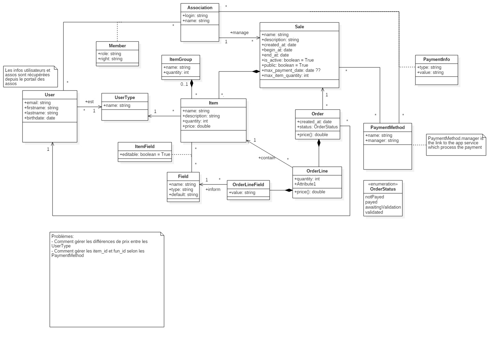

# Développement de Woolly

Actuellement le développement est assuré par [@abrasseu](https://github.com/abrasseu) et (@axbarbosa)[https://github.com/axbarbosa]. N'hésitez pas à les contactez si vous êtes chauds pour rejoindre le projet.

## UML

L'UML a été crée avec [StarUML](http://staruml.io/download).

## Structure de l'application

L'application se base autour de 3 grands modules :
- authentication
- payment
- sales

### authentication

C'est ici que les modèles utilisateurs sont définis. Le seul but de ce module est d'authentifier Woolly au Portail des Assos via OAuth, et d'authentifier l'utilisateur à Woolly via un JWT. Pour plus d'information sur ces mécanismes, [voir ici](./authentication.md).

### payment

Ce module est responsable du paiement via des services externes comme Payutc.

### sales

Il s'agit du coeur de Woolly. C'est ici que sont gérés les ventes et les articles.
